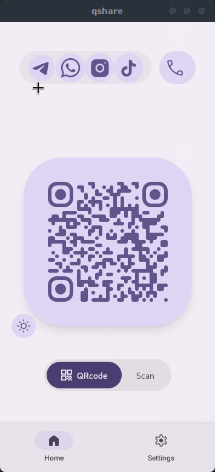

# QShare.js

> 📱 Android application for convenient sharing of social media contacts via QR codes

[](https://www.android.com/)
[](https://tauri.app/)
[](https://reactjs.org/)


## 📖 Overview

QShare.js allows users to generate and scan QR codes containing their social network contact information. Share your profiles instantly - no typing required, just scan and connect!

## ✨ Key Features

- 📱 **Native Android Application** - Built with Tauri 2 for optimal performance
- 🎨 **Material Design 3 UI** - Modern and familiar Android interface
- 📷 **QR Code Generation & Scanning** - Create and scan profile QR codes
- 🎯 **Multiple Social Networks** - Support for various platforms (Instagram, Twitter, LinkedIn, etc.)
- 🌓 **Theme Support** - Light and dark modes
- 💾 **Local Storage** - Your data stays on your device
- ⚡ **Fast & Lightweight** - Rust backend for superior performance

## 📸 Screenshots

| Home Screen | Settings Screen |
|-------------|-----------------|
|  |  |

## 🛠️ Tech Stack

| Component | Technology |
|-----------|-----------|
| **Frontend** | React 19.1, Vite 7.0, TailwindCSS 4.1 |
| **UI Framework** | Material Design 3 via `@material-react/web` |
| **Backend** | Rust (Tauri 2) |
| **Platform** | Android (Tauri Mobile) |
| **Communication** | Tauri IPC |

## 🚀 Getting Started

### Prerequisites

Before you begin, ensure you have the following installed:

1. **Node.js** (v18 or later) - [Download](https://nodejs.org/)
2. **Rust** - [Install via rustup](https://rustup.rs/)
3. **Android Studio** and **Android SDK**
4. **Rust Android targets**:

   ```bash
   rustup target add aarch64-linux-android armv7-linux-androideabi i686-linux-android x86_64-linux-android
   ```

5. **Android environment variables** - Set `ANDROID_HOME`, `NDK`, etc.

### Installation

```bash
# Clone the repository
git clone <repository-url>
cd QShare.js

# Install dependencies
npm install
```

### ⚠️ Important: Android Back Button Configuration

This project uses `tauri-plugin-app-events` for proper Android back button handling. After initializing or regenerating Android files, run:

```bash
./scripts/patch-mainactivity.sh
```

**Why is this needed?**

- The `src-tauri/gen/` directory is auto-generated by Tauri
- Custom MainActivity.kt modifications are required for back button support
- The patch script applies necessary changes and creates a backup

**What it does:**

- ✅ Enables Android back button event handling
- ✅ Preserves camera permissions and edge-to-edge display
- ✅ Allows closing modals/sidebars without exiting the app

### Development

Run the app in development mode with hot reload:

```bash
npm run tauri android dev
```

**Tip:** If MainActivity.kt is regenerated and back button stops working:

```bash
./scripts/patch-mainactivity.sh
npm run tauri android dev
```

### Building

#### Release APK

```bash
npm run tauri android build
```

Output: `src-tauri/gen/android/app/build/outputs/apk/release/`

#### Debug APK

```bash
npm run tauri android build -- --debug
```

Output: `src-tauri/gen/android/app/build/outputs/apk/debug/`

## 📁 Project Structure

```text
QShare.js/
├── src/                              # Frontend (React)
│   ├── components/                   # Reusable UI Components
│   │   ├── AddNetworkFAB/           # Floating Action Button for adding networks
│   │   ├── Navigation/              # Navigation system (Bottom bar, controller, items)
│   │   ├── QRCode/                  # QR code generator component
│   │   ├── SegmentedButton/         # Material Design segmented button
│   │   ├── SocialNetworkCard/       # Display card for social network profiles
│   │   ├── SocialNetworkEditor/     # Modal editor for profile data
│   │   ├── SocialNetworkIcon/       # Social network icon renderer
│   │   ├── SocialNetworkPicker/     # Network selection dialog
│   │   └── ThemeSelector/           # Theme switcher component
│   │
│   ├── pages/                       # Application Pages
│   │   ├── Home/                    # Home page with QR and Scan screens
│   │   │   ├── Home.tsx             # Main home page layout
│   │   │   ├── QRcodeScreen.tsx     # QR code generation screen
│   │   │   └── ScanScreen.tsx       # QR code scanner screen
│   │   └── Settings/                # Settings page
│   │       └── Settings.tsx         # App settings & network management
│   │
│   ├── context/                     # React Context Providers
│   │   └── SocialNetworksContext.tsx # Global state for social networks
│   │
│   ├── data/                        # Static Data & Configuration
│   │   └── socialNetworks.json      # Social network definitions & metadata
│   │
│   ├── hooks/                       # Custom React Hooks
│   │   └── useCSSVariable.ts        # Hook for accessing CSS variables
│   │
│   ├── styles/                      # Global Styles & Themes
│   │   ├── index.js                 # Main stylesheet entry
│   │   ├── layout.css               # Layout styles
│   │   ├── light.css / dark.css     # Theme stylesheets
│   │   └── *.css                    # Theme variants (high contrast, medium contrast)
│   │
│   ├── theme/                       # Theme Configuration
│   │   └── colors.ts                # Material Design 3 color utilities
│   │
│   ├── assets/                      # Static Assets
│   │   └── icons/                   # Custom SVG icons
│   │
│   ├── App.jsx                      # Root application component
│   └── main.jsx                     # React application entry point
│
├── src-tauri/                       # Backend (Rust + Tauri)
│   ├── src/
│   │   ├── lib.rs                   # Main Tauri logic & IPC commands
│   │   └── main.rs                  # Application entry point
│   │
│   ├── gen/                         # ⚠️ Auto-generated (DO NOT EDIT)
│   │   └── android/                 # Android project files
│   │       └── app/src/main/java/   # MainActivity.kt (needs patch)
│   │
│   ├── icons/                       # App icons (multiple resolutions)
│   ├── capabilities/                # Tauri permission definitions
│   │   └── default.json             # Default permissions
│   ├── Cargo.toml                   # Rust dependencies
│   └── tauri.conf.json              # Tauri app configuration
│
├── material-react/                  # Custom Material Design 3 Library
│   ├── components/                  # React wrappers for MD3 components
│   │   ├── Button.tsx               # Button components (Filled, Outlined, etc.)
│   │   ├── TextField.tsx            # Text input components
│   │   ├── Dialog.tsx               # Modal dialogs
│   │   ├── BottomSheet.tsx          # Bottom sheet component
│   │   ├── Navigation.tsx           # Navigation components
│   │   └── ...                      # Other MD3 components
│   ├── utils/                       # Utility functions
│   │   └── createComponent.tsx      # Component factory helper
│   ├── styles/                      # Library styles
│   ├── index.ts                     # Library public API
│   └── package.json                 # Library dependencies
│
├── scripts/                         # Build & Automation Scripts
│   └── patch-mainactivity.sh        # Android back button patch script
│
├── assets/                          # Documentation & Media
│   ├── Home-QRcode.png             # Screenshot: Home screen
│   ├── Settings.png                # Screenshot: Settings screen
│   └── icon.png                    # App icon
│
├── package.json                     # Node.js project configuration
├── vite.config.js                   # Vite bundler configuration
├── tsconfig.json                    # TypeScript configuration
├── tailwind.config.js               # TailwindCSS configuration
├── postcss.config.js                # PostCSS configuration
└── CLAUDE.md                        # AI assistant development guide
```

## 🔌 Tauri Plugins

| Plugin | Purpose |
|--------|---------|
| `tauri-plugin-store` | Persistent local data storage |
| `tauri-plugin-opener` | Open URLs in default browser |
| `tauri-plugin-barcode-scanner` | QR code scanning functionality |
| `tauri-plugin-app-events` | Android system events & back button |

## 🧪 Development Tips

### Type Checking

```bash
npx tsc --noEmit
```

### Material React Library

- Local package providing React wrappers for Material Web Components
- Located in `/material-react` directory
- After modifying, reinstall with `npm install`

### Android Back Button

- Requires MainActivity.kt patch (see [Android Back Button Configuration](#️-important-android-back-button-configuration))
- Must be reapplied if `src-tauri/gen/` is regenerated

### Architecture

- Tauri 2 provides native WebView container
- Rust backend communicates with React via IPC
- Designed for optimal performance and small bundle size

## 🤝 Contributing

This project is in active development. Contributions, bug reports, and feature requests are welcome!

## 📄 License

[Add license information]

## 👏 Acknowledgments

- Built with [Tauri](https://tauri.app/)
- UI components from [Material Web](https://github.com/material-components/material-web)
- Icons from [Material Symbols](https://fonts.google.com/icons)
