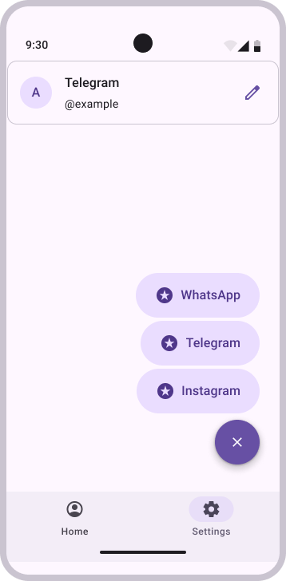

# QShare.js

QShare.js is a desktop application for convenient sharing of social media contacts via QR codes.

## Project Status

The project is in early development stage.

## Description

The application allows users to generate QR codes containing their contact information from various social networks. This makes profile sharing simple and fast - just scan the code.

## Screen Designs

### Home Screen (QR Code Generation)


### Settings



## Tech Stack

- **Frontend:** React 19.1, Vite 7.0
- **Backend:** Rust (Tauri 2)
- **Communication:** Tauri IPC

## Installation and Running

### Install Dependencies

```bash
npm install
```

### Run in Development Mode

```bash
npm run tauri dev
```

### Build Application

```bash
npm run tauri build
```
